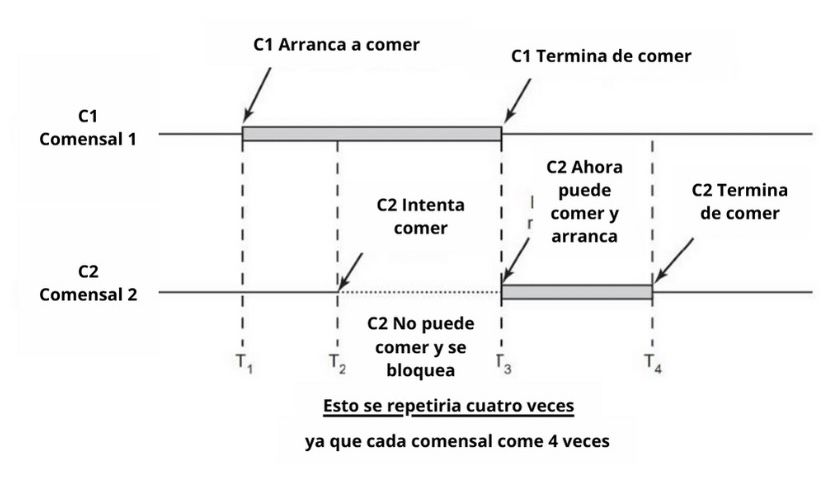

1)
A)Lo que se puede notar es que todos los tiempos de ejecucion son distintos, si porque no siempre que ejecutes el mismo programa va a tardar el mismo tiempo.

B)Compare con dos compañeros y en todas las ejecuciones son distintos los tiempos.

C)Lo que paso fue que al descomentar las lineas, el tiempo de ejecucion fue mucho mas lento, ya que al usar el bucle for

2A)
<a href="./punto2/con_race_condition.c">terminado</a>

2B)
